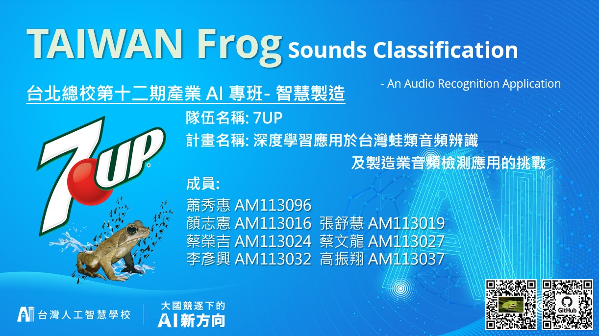

# Frog Sounds Classification_An Audio Recognition Application
## 台北總校第十二期產業 AI 專班- 智慧製造

## Code

### Install dependencies

```
python -m pip install -r requirements.txt
```

This code was tested with python 3.7  


## Script Introduction

```DataGenerator.py``` is used to collect the frog's sounds from audio data and intergrate to Dataframe.

```FeatureExtraction.py``` is used to preprocess the training data and extract the feature by MFCC.

```SVM_model``` is our proposed model trained before.

```Demo.ipynb``` is the script to demonstrate with the trained model.

## Introduction

